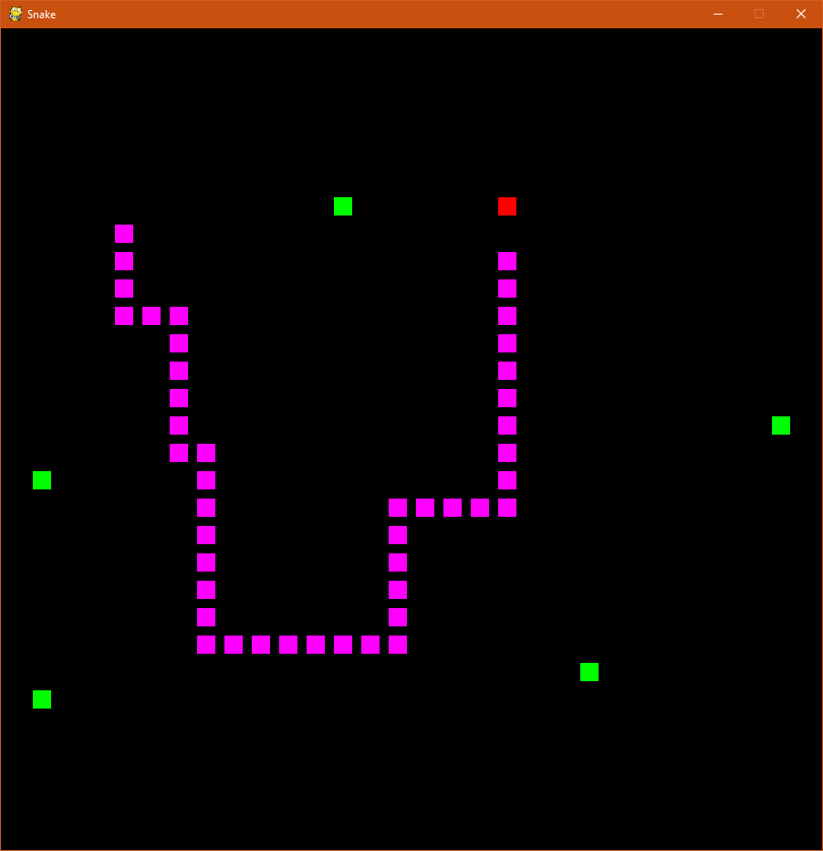

Python Arcade is meant to be a free retro arcade meant for fans of old games.
\*at present it's a naive attempt at snake -\_-

Feel free to pull the code and play!

Just run python-arcade-snake.py in your terminal!

## Screenshots
`Screenshots`

Tech Stack:

Python,
Pygame

Future Stack:
Flask- for storing high scores in the backend.
